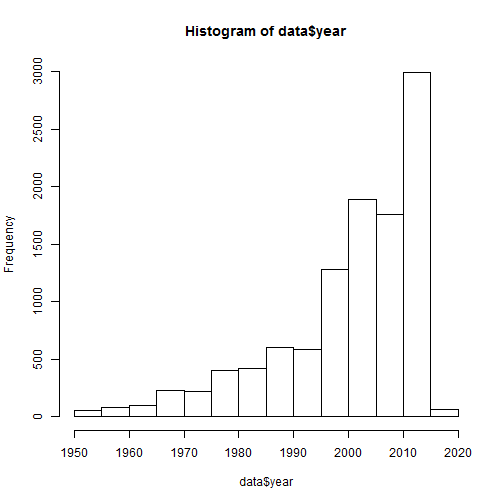

## What are Legos?

Legos are plastic bricks that can be snapped into shapes.

Legos come in themed sets that can have pieces ranging from tens to thousands.

Where is the trend in these toys headed? Are set numbers increasing? Numbers of pieces?

To answer questions like these we can look at a dataset provided by the lego crafting site Rebrickable.

--- 

## What is the Rebrickable dataset?

Rebrickable hosts piece, color, shape and quantity information for each lego set.

If you enter a few different lego sets that you have, you are given alternate sets you can build with the pieces you have.

With such a wealth of data to investigate, visualizations on themes, pieces, and pieces by theme over the years could provide valuable insight into the direction the Lego landscape is headed.

---

## Importance of data visualization

An illustrative example shows that the number of total sets in a year is increasing almost exponentially over time. 

---

